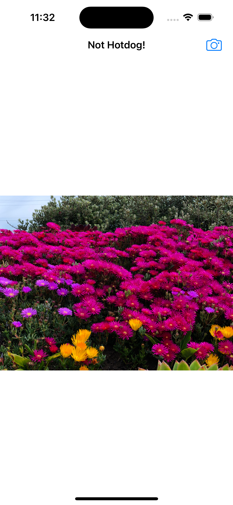

# SeeFood 🌭

As seen on Silicon Valley Season 4, this iOS app takes an image and tells you if the object in it is a hotdog or not.

Uses the pre-trained Inceptionv3.mlmodel from Apple. Install it from here: 

https://docs-assets.developer.apple.com/coreml/models/Inceptionv3.mlmodel

This app can also work offline.

Created with Swift and CoreML as a part of the iOS App Development Bootcamp by Angela Yu.

